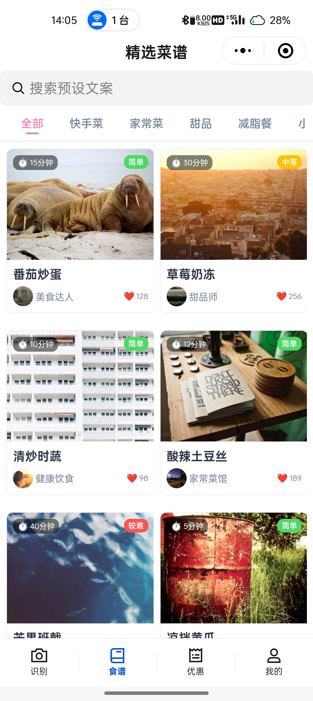

# 菜谱喵（PawRecipe）

> "爪爪一点，厨房不难！" Tap with a paw — cooking's a breeze!

## 项目概述

菜谱喵（PawRecipe）是一款专注于**单类蔬菜识别**的智能烹饪服务应用，打造了从**食材视觉识别**到**个性化菜谱生成**，再到**食材及周边采购链路**的一体化解决方案。

用户只需上传单种蔬菜图像，系统便能实现：

- 借助计算机视觉技术精准识别蔬菜品类（涵盖茄子、芋头、苦瓜等常见蔬菜）；
- 结合大模型生成适合家庭场景的中式家常菜谱；
- 关联菜谱所需食材供应链及厨房用品购置渠道，形成完整的烹饪服务闭环。

本项目融合自训练CNN模型与大模型能力，打通图像感知、语义生成与生活服务链路，为厨房新手提供轻量化、高效率的烹饪决策支持。

<br>

<br>

<br>

<br>

## 技术架构

### 技术栈

| 组件               | 用途                   |
|------------------|----------------------|
| **MinIO**        | 存储原始用户上传图片           |
| **RabbitMQ**     | 异步解耦上传与AI处理流程        |
| **PyTorch**      | 训练和推理蔬菜分类CNN模型       |
| **LLM**          | 生成个性化、可操作的食谱         |
| **Java + MySQL** | 负责用户管理、偏好记录及历史查询     |
| **UniApp**       | 跨平台移动应用开发框架（支持多端部署）  |
| **Redis**        | 缓存热门蔬菜的通用食谱，提升响应速度   |
| **Vue 3**        | 构建管理端前端界面            |
| **MyBatis-Plus** | 简化MySQL数据库操作，提供分页等功能 |
| **Sa-Token**     | 处理用户认证与授权            |
| **TDesign**      | 移动端UI组件库（确保跨端一致性）    |
| **Pinia**        | 状态管理库（支持数据持久化）       |

## 功能亮点

1. **精准的蔬菜识别**：基于自训练的CNN模型，能准确识别多种常见蔬菜，为后续菜谱生成提供可靠基础。

2. **个性化菜谱生成**：结合多模态大模型，根据识别出的蔬菜，生成符合家庭场景的中式家常菜谱，满足不同用户的口味和烹饪需求。

3. **完整的服务闭环**：关联食材供应链和厨房用品购置渠道，让用户在获取菜谱后能便捷地购买所需物品，提升烹饪体验。

4. **高效的响应速度**：利用Redis缓存热门蔬菜的通用食谱，减少重复计算，加快系统响应时间。

5. **多端适配能力**：基于UniApp框架实现一次开发，多端部署（支持微信小程序、H5、App等平台），覆盖更广泛的用户场景。

## 移动端核心功能模块

| 模块       | 功能描述                       |
|----------|----------------------------|
| **拍照识别** | 调用设备相机拍摄蔬菜照片，实时上传至后端进行品类识别 |
| **食谱库**  | 展示识别后的蔬菜相关菜谱，支持按烹饪难度、耗时筛选  |
| **优惠活动** | 推荐食材及厨房用品的优惠信息，关联菜谱所需原料    |
| **个人中心** | 用户信息管理、历史浏览记录、收藏菜谱等功能      |

## 快速开始

### 环境要求

- 后端：Java 11+、MySQL 8.0+、Redis 6.0+、RabbitMQ 3.8+、PyTorch 1.10+
- 前端：
    - 管理端：Node.js 16+、Vue 3
    - 移动端：Node.js 16+、UniApp 3.0+、pnpm 7.0+

### 安装步骤

1. 克隆仓库：
   ```bash
   git clone https://github.com/jiangbyte/paw-pecipe
   cd paw-recipe
   ```

2. 后端部署：
    - 配置MySQL、Redis、RabbitMQ等服务
    - 导入数据库脚本
    - 启动Java服务

3. 前端部署：
    - 管理端：
      ```bash
      cd vue-admin
      pnpm install
      pnpm run dev
      ```
    - 移动端（UniApp）：
      ```bash
      cd uniapp
      pnpm install
      # 运行到H5
      pnpm run dev:h5
      # 运行到微信小程序（需安装微信开发者工具）
      pnpm run dev:mp-weixin
      ```