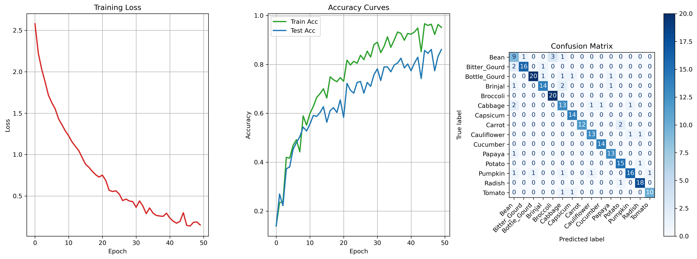

# CNN 蔬菜识别模型

基于卷积神经网络的蔬菜种类深度学习模型，并提供了一个完整的流程，包括数据加载、模型训练、评估以及导出为ONNX格式以支持后续部署

## 主要功能

- 使用自定义的`VegetableDataset`类加载HBase中的蔬菜图像数据集
- 构建并训练了基于PyTorch的卷积神经网络模型`VegetableCNN`
- 支持模型的保存与加载，并能将模型导出为ONNX格式以便于部署

## 配置HBase连接

[Hbase表.md](test%2FHbase%E8%A1%A8.md)

## 训练数据分析结果

