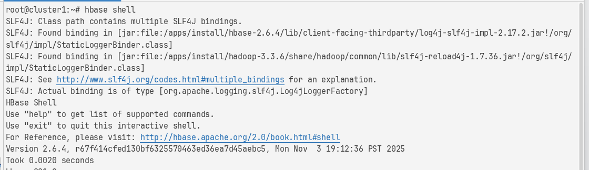
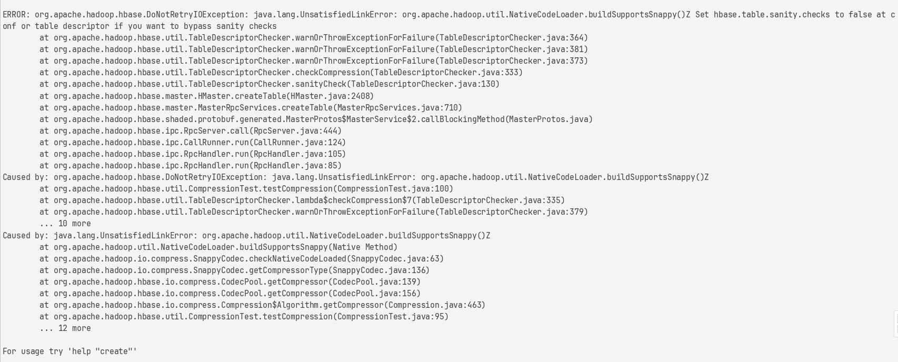
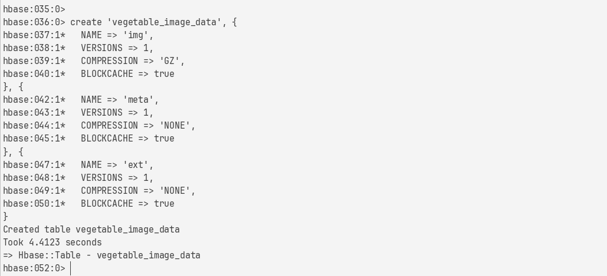
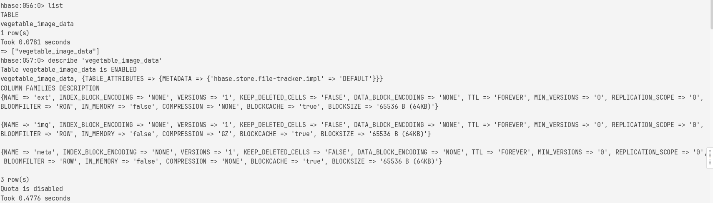

## 需求

- 存储大量蔬菜图像（原始字节）
- 每张图有标签（如 Tomato）、来源（用户上传 / 爬虫 / 合作方）
- 支持按类别高效采样（训练时需均衡各类别）
- 支持快速插入（数据标注后批量入库）（SpringBoot/Django 数据标注）

## happybase 安装

```bash
# 从 conda-forge 安装 thrift（包含 libthrift 和 python-thrift）
mamba install -c conda-forge thrift -y

pip install happybase
```

```bash
# 1. 进入 HBase Shell
hbase shell

# 2. 禁用表（disable）
disable 'vegetable_image_data'

# 3. 删除表（drop）
drop 'vegetable_image_data'

# 4. 验证是否已删除
list
```

## HBase 表设计

### 表名

```text
vegetable_image_data
```

### 列族设计（Column Families）

| 列族名    | 用途               | 存储内容                                                | 设计理由                                        |
|--------|------------------|-----------------------------------------------------|---------------------------------------------|
| `img`  | **图像二进制数据**      | `raw: <JPEG bytes>`                                 | 图像大对象单独列族，避免 scan 时拖慢其他字段；可独立设置压缩（如 SNAPPY） |
| `meta` | **元数据（高频访问）**    | `label`, `source`, `upload_time`, `width`, `height` | 小字段聚合，读取 label 时不加载图片，提升训练效率                |
| `ext`  | **扩展属性（低频/未来用）** | `season`, `origin`, `is_organic`                    | 预留扩展性，不影响主流程                                |

### RowKey 设计

```text
{label}_{timestamp}_{random_suffix}
```

例子：按类别_时间戳_随机后缀

```
Tomato_1712345678901_a3f8
Carrot_1712345679012_b2e1
```

- **热点写入**（所有 Tomato 都写到同一 region），加入 `timestamp` + `random_suffix`（4位十六进制），打散 RowKey，避免单 region
  过载
- **按类别查询**（训练时需获取所有 Tomato），加入 `label` 前缀，可用 `PrefixFilter` 或 `RowFilter` 高效扫描某类
- **唯一性**（毫秒级时间戳 + 随机数），避免数据倾斜
- **时间局部性**，相近时间的数据物理靠近，利于压缩

> 自增 ID会导致严重写热点。

### HBase Shell 建表

```
hbase shell
```



```hbase
create 'vegetable_image_data', {
  NAME => 'img',
  VERSIONS => 1,
  COMPRESSION => 'GZ',
  BLOCKCACHE => true
}, {
  NAME => 'meta',
  VERSIONS => 1,
  COMPRESSION => 'NONE',
  BLOCKCACHE => true
}, {
  NAME => 'ext',
  VERSIONS => 1,
  COMPRESSION => 'NONE',
  BLOCKCACHE => true
}
```

> 开始用**SNAPPY**的时候出现报错 HBase 在创建表时尝试验证 Snappy 压缩支持，但本地 Hadoop Native 库缺失或未正确加载

> java.lang.UnsatisfiedLinkError: org.apache.hadoop.util.NativeCodeLoader.buildSupportsSnappy()

> HBase/Hadoop 环境 没有安装或配置 Snappy 原生库（native library），而 HBase 默认启用了“表结构健康检查”（sanity
> checks），会拒绝使用不支持的压缩算法





- `COMPRESSION => 'GZ'`：Gzip，纯 Java 实现，无需 native 库，但速度慢）
- `VERSIONS => 1`：不需要历史版本（图像不会更新）
- `BLOCKCACHE => true`：开启读缓存，加速训练时的频繁读取

> 缺点：GZ 压缩率高但 CPU 开销大；NONE 不省空间

因此 表设计采用 img 列族存储图像，并预留 SNAPPY 压缩以优化存储成本。在本地开发环境中，因 native 库限制，实际使用 GZ 压缩或
NONE 进行验证。

## 数据写入测试（Python happybase）

[test_hbase_write.py](test%2Ftest_hbase_write.py)

确认表存在并查看结构

```hbase
list

describe 'vegetable_image_data'

scan 'vegetable_image_data', {FILTER => "PrefixFilter('Tomato')", LIMIT => 5}
```



