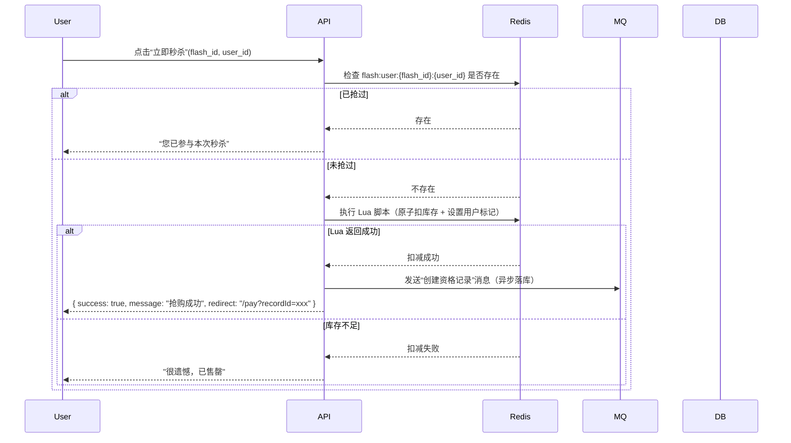

## 普通商品流程

### 流程：

1. 用户加入购物车 → `biz_cart`
2. 用户直接购买（跳过购物车）→ 可直接创建订单
3. 下单后未按时支付 → 自动取消

### 对应表

| 步骤   | 表                              | 说明                                                 |
|------|--------------------------------|----------------------------------------------------|
| 购物车  | `biz_cart`                     | 支持加购、选中、数量管理                                       |
| 直接购买 | —                              | 前端可不经过购物车，直接调下单接口                                  |
| 订单创建 | `biz_order` + `biz_order_item` | 包含 `expired_at` 字段用于超时判断                           |
| 自动取消 | —                              | 通过定时任务扫描 `status=0 AND expired_at < NOW()` 的订单进行取消 |

## 秒杀商品流程

### 流程：

1. **用户必须秒杀成功** → 才能获得“购买名额”
2. 有购买名额 → 才能创建订单
3. 支付超时 → 取消订单，并**释放名额/库存**

#### 秒杀资格记录表

1. 用户点击秒杀 → 后端尝试插入 `biz_flash_sale_record`（同时扣 Redis/DB 库存）
2. 插入成功 → 返回“抢购成功”，前端跳转支付页
3. 用户支付时 → 先查该记录是否存在且未过期 → 再创建订单，并更新 `status=1`
4. 订单支付成功 → 更新 `status=2`
5. 资格过期或订单取消 → 更新 `status=3`，并释放库存

## 秒杀系统

| 目标        | 说明                      |
|-----------|-------------------------|
| **防止超卖**  | 库存不能超扣（100 件最多卖出 100 件） |
| **高并发支撑** | 支持多人同时抢购                |
| **资格隔离**  | 只有抢到名额的人才能下单            |
| **失败回滚**  | 资格过期/支付失败 → 自动释放库存      |

### 缓存层（Redis）

#### Redis Key 设计（按活动 ID 隔离）

| Key                               | 类型       | 说明                                    |
|-----------------------------------|----------|---------------------------------------|
| `flash:stock:{flash_id}`          | String   | **预加载的库存数量**（如 "100"），用于原子扣减          |
| `flash:user:{flash_id}:{user_id}` | String   | 标记用户是否已抢过（防重复点击），值可为 "1"，TTL = 活动结束时间 |
| `flash:queue:{flash_id}`          | List（可选） | 若需排队限流，可作为请求队列（进阶用）                   |

> 所有秒杀请求**先走 Redis**，不直接查 DB

### 流程



### Lua 脚本（保证原子性）

```lua
-- KEYS[1]: flash:stock:{flash_id}
-- KEYS[2]: flash:user:{flash_id}:{user_id}
-- ARGV[1]: user_id
-- ARGV[2]: expire_seconds (如 300)

local stock = tonumber(redis.call('GET', KEYS[1]))
if stock == nil or stock <= 0 then
    return 0  -- 库存不足
end

-- 检查是否已抢过（双重保险）
if redis.call('EXISTS', KEYS[2]) == 1 then
    return -1  -- 已抢过
end

-- 扣库存
redis.call('DECR', KEYS[1])
-- 标记用户已抢
redis.call('SET', KEYS[2], '1', 'EX', ARGV[2])

return 1  -- 成功
```

### 支付流程（资格 → 订单）

用户抢到后跳转支付页，携带 `record_id`。

### 超时取消 & 库存回滚

#### 两种场景需要释放库存：

1. **资格过期未下单**（5分钟内没点支付）
2. **订单创建但未支付**（30分钟超时）

#### 延迟队列

- 使用 RabbitMQ 实现延迟消息
- 用户抢到时，投递一条 **5分钟后执行** 的“检查资格”消息
- 用户下单时，投递一条 **30分钟后执行** 的“检查支付”消息
- 消费者检查状态，若未完成则释放库存

> **延迟队列 + MQ**，避免轮询压力。

### 库存回补机制

### 限流 & 降级策略（高可用）

| 策略           | 说明                              |
|--------------|---------------------------------|
| **Nginx 限流** | 单 IP 限制 10 QPS，防刷               |
| **网关层熔断**    | Hystrix/Sentinel，异常时返回“活动太火爆”   |
| **静态化页面**    | 秒杀前 5 分钟，商品详情页 CDN 缓存           |
| **按钮置灰**     | 前端根据 `start_time` 控制点击（但后端仍需校验） |
